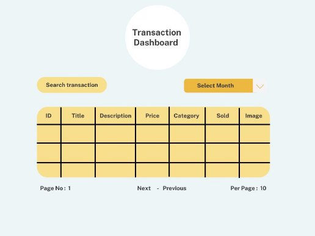
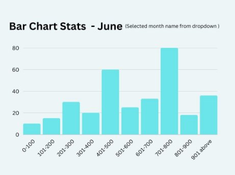

**MERN Stack Coding Challenge**

**Backend Task**

Data Source

THIRD PARTY API URL : https://s3.amazonaws.com/roxiler.com/product\_transaction.json REQUEST METHOD : GET

RESPONSE FORMAT : JSON

**GET**

Create API to initialize the database. fetch the JSON from the third party API and initialize the database with seed data. You are free to define your own efficient table / collection structure

**Instruction**

All the APIs below should take month ( expected value is any month between January to December) as an input and should be matched against the field dateOfSale regardless of the year.

**GET**

**Create an API to list the all transactions**

- API should support search and pagination on product transactions
- Based on the value of search parameters, it should match search text on product title/description/price and based on matching result it should return the product transactions
- If search parameter is empty then based on applied pagination it should return all the records of that page number
- Default pagination values will be like page = 1, per page = 10

**GET**

**Create an API for statistics**

- Total sale amount of selected month
- Total number of sold items of selected month
- Total number of not sold items of selected month

**GET**

**Create an API for bar chart ( the response should contain price range and the number of items in that range for the selected month regardless of the year )**

- 0 - 100
- 101 - 200
- 201-300
- 301-400
- 401-500
- 501 - 600
- 601-700
- 701-800
- 801-900
- 901-above

**GET**

**Create an API for pie chart Find unique categories and number of items from that category for the selected month regardless of the year**.

For example :

- X category : 20 (items)
- Y category : 5 (items)
- Z category : 3 (items)

**GET**

**Create an API which fetches the data from all the 3 APIs mentioned above, combines the response and sends a final response of the combined JSON**

**Frontend Task**

By using above created apis, create the following table and charts on single page. Follow the given mockups and you can implement your own design to change the look and feel

**Transctions Table**

- Here use your transactions listing api to list transactions in the table
- Select month dropdown should display **Jan** to **Dec** months as an options
- By default **March** month should be selected
- Table should list the transactions of the selected month irrespective of the year using API
- Search transaction box should take an input and if search text is matching with anyone of these title/description/price then those transactions of the selected month should come in the list using API
- If user clear’s the search box then initial list of transactions should be displayed for the selected month using API
- On click of **Next** it should load the next page data from API
- On click of **Previous** it should load the previous page data from API

**Transctions Statistics (**Use your created API to fetch the data**)**

- Here display **total amount of sale**, **total sold items**, and **total not sold item** in the box for the selected month from the drop down (present above table) using API

**Transactions Bar Char (**Use your created API to fetch the data**)**

- Chart should display the price range and the number of items in that range for the selected month irrespective of the year using API
- Month selected from dropdown (above the table) should be applied here
